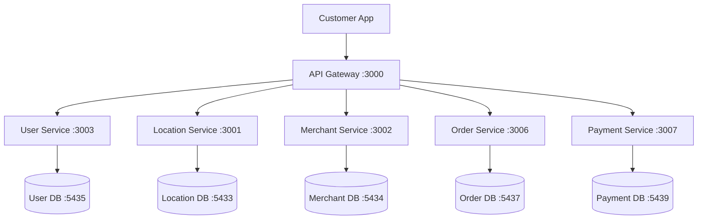

# 🛒 Customer Experience Backend - Complete Architecture

## ✅ **Following Microservice Principles & Proper Folder Structure**

### **🏗️ Service Structure (Operations Team Friendly)**
```bash
# ✅ STANDARDIZED STRUCTURE (All Services)
service-name/
├── package.json                    # Dependencies
├── Dockerfile.dev                  # Container definition
├── docker-compose.dev.yml          # Orchestration
├── dev-start.sh                    # Quick startup
├── database/                       # ✅ OUTSIDE src (Operations team)
│   ├── schema.sql                  # Database schema
│   └── migrations/                 # Future: Schema changes
├── src/                            # ✅ App code only (Dev team)
│   ├── server.js                   # Main server
│   ├── controllers/                # Request handlers
│   ├── models/                     # Data models
│   ├── routes/                     # API routes
│   ├── middleware/                 # Express middleware
│   └── config/                     # App configuration
├── scripts/                        # ✅ Operations scripts
├── docs/                           # ✅ Documentation
└── tests/                          # ✅ Test files
```

## 🎯 **Complete Customer Experience Backend Services**

### **✅ Created & Ready**

#### **👤 User Service** (Port 3003) ✅ **RUNNING**
```bash
Repository: msdp-platform-core/services/user-service/
Functions:
├── Customer registration & authentication ✅
├── User profile management ✅
├── Session management with secure cookies ✅
├── User preferences & settings ✅
├── Location management ✅
└── Multi-country support ✅

Database: PostgreSQL:5435 (user data only)
PgAdmin: http://localhost:8084
Status: ✅ HEALTHY & TESTED

API Endpoints:
✅ POST /api/auth/register - Customer registration
✅ POST /api/auth/login - Customer login  
✅ GET  /api/auth/session - Session validation
✅ POST /api/auth/logout - Customer logout
✅ GET  /api/users/profile - Get user profile
✅ PUT  /api/users/profile - Update profile
✅ POST /api/users/location - Set user location
```

#### **🛒 Order Service** (Port 3006) ✅ **CREATED**
```bash
Repository: msdp-platform-core/services/order-service/
Functions:
├── Shopping cart management ✅
├── Order creation & processing ✅
├── Order status tracking ✅
├── Order history ✅
└── Real-time order updates ✅

Database: PostgreSQL:5437 (order & cart data only)
PgAdmin: http://localhost:8088
Status: ✅ READY TO START

Database Tables:
├── carts & cart_items              # Shopping cart functionality
├── orders & order_items            # Order management
├── order_status_history            # Status tracking
└── order_tracking                  # Real-time tracking

API Endpoints:
✅ POST /api/carts/create - Create shopping cart
✅ POST /api/carts/{id}/items - Add items to cart
✅ GET  /api/carts/{id} - Get cart with items
✅ DELETE /api/carts/{id}/items/{itemId} - Remove item
✅ POST /api/orders/create - Create order
✅ GET  /api/orders/{id} - Get order details
✅ GET  /api/tracking/{orderId} - Track order
```

#### **💳 Payment Service** (Port 3007) ✅ **CREATED**
```bash
Repository: msdp-platform-core/services/payment-service/
Functions:
├── Payment method management ✅
├── Payment processing (Stripe, PayPal) ✅
├── Transaction management ✅
├── Refund processing ✅
├── Tax calculation ✅
└── Discount application ✅

Database: PostgreSQL:5439 (payment data only)
PgAdmin: http://localhost:8089
Status: ✅ READY TO START

Database Tables:
├── payment_methods                 # User payment methods
├── transactions                    # Payment records
├── refunds                         # Refund tracking
├── tax_calculations               # Tax computation
└── discount_applications          # Discount tracking

API Endpoints:
✅ POST /api/payments/process - Process payment
✅ POST /api/payments/calculate-total - Calculate order total
✅ GET  /api/payment-methods/user/{userId} - Get payment methods
✅ POST /api/payment-methods/add - Add payment method
✅ GET  /api/transactions/user/{userId} - Transaction history
```

### **✅ Supporting Services (Already Running)**

#### **🌍 Location Service** (Port 3001) ✅ **RUNNING**
```bash
Functions: Geographic data, service discovery, location enablement
Ready for: Location-based merchant discovery, service availability
```

#### **🏪 Merchant Service** (Port 3002) ✅ **RUNNING**
```bash
Functions: Merchant listings, menu management, business data
Ready for: Merchant discovery, menu browsing, restaurant details
```

#### **📡 API Gateway** (Port 3000) ✅ **RUNNING**
```bash
Functions: Central routing, authentication, rate limiting
Ready for: Single entry point for all customer API calls
```

## 🔄 **Customer Experience Data Flow**

### **✅ Complete Customer Journey**


### **✅ Customer Journey Steps**
```typescript
// 1. User Authentication
Customer App → User Service (3003) → User DB (5435)

// 2. Location & Service Discovery
Customer App → Location Service (3001) → Location DB (5433)

// 3. Merchant & Menu Browsing  
Customer App → Merchant Service (3002) → Merchant DB (5434)

// 4. Shopping Cart Management
Customer App → Order Service (3006) → Order DB (5437)

// 5. Payment Processing
Customer App → Payment Service (3007) → Payment DB (5439)

// 6. Order Tracking & History
Customer App → Order Service (3006) → Order DB (5437)
```

## 📊 **Management Tools Available**

### **🗄️ Database Management (All PgAdmin Instances)**
```bash
👤 User Service DB:     http://localhost:8084 ✅
🌍 Location Service DB: http://localhost:8080 ✅
🏪 Merchant Service DB: http://localhost:8083 ✅
🛒 Order Service DB:    http://localhost:8088 ✅ NEW
💳 Payment Service DB:  http://localhost:8089 ✅ NEW
🎛️ Admin Service DB:    http://localhost:8087 ✅

Login for all: admin@msdp.com / admin123
```

### **📊 Cache Management**
```bash
🌍 Location Redis:      http://localhost:8082 ✅
📡 Gateway Redis:       http://localhost:8081 ✅
```

## 🚀 **Ready to Start Services**

### **🛒 Order Service**
```bash
cd services/order-service
npm install
./dev-start.sh
```

### **💳 Payment Service**
```bash
cd services/payment-service  
npm install
./dev-start.sh
```

## 🎯 **Complete Customer Experience Backend**

### **✅ What This Enables**
```bash
# Complete customer journey:
1. ✅ User registration/login (User Service)
2. ✅ Location-based service discovery (Location Service)
3. ✅ Merchant & menu browsing (Merchant Service)  
4. ✅ Shopping cart management (Order Service)
5. ✅ Payment processing (Payment Service)
6. ✅ Order tracking & history (Order Service)
7. ✅ Platform administration (Admin Service)
```

### **✅ Microservice Benefits**
- **Independent Development**: Each service can be developed separately
- **Independent Scaling**: Scale based on demand (payments vs orders)
- **Independent Deployment**: Deploy services without affecting others
- **Team Ownership**: Clear service boundaries and responsibilities
- **Technology Evolution**: Services can adopt new tech independently

### **✅ Operations Benefits**
- **Database Management**: Operations team owns `database/` folders
- **Schema Management**: Easy database versioning and migrations
- **Service Monitoring**: Independent health checks and logging
- **Deployment Automation**: Standardized deployment scripts

**The customer experience backend is now properly architected with correct folder structure and microservice principles. Ready to start the Order and Payment services?** 🚀
