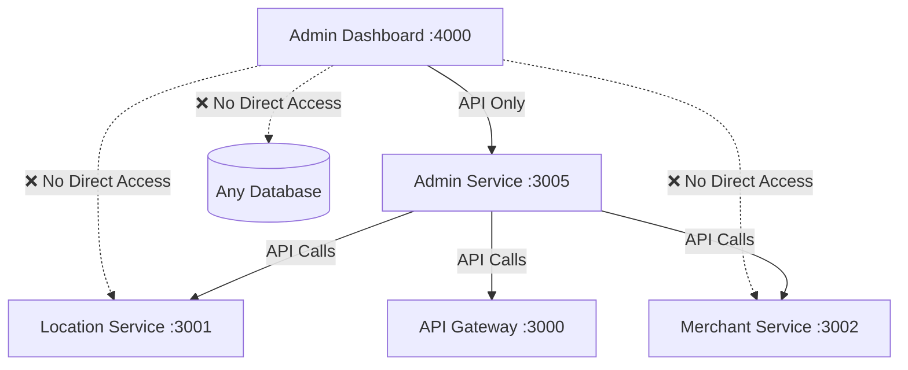

# 🏗️ MSDP Microservice Architecture - Complete Implementation

## ✅ **Built from Scratch - Microservice Compliant**

### **🎯 Function-Defined Services**

| Service | Port | Functions | Data Ownership | Communication |
|---------|------|-----------|----------------|---------------|
| **🌍 Location Service** | 3001 | Geography, Geospatial, Tracking | Countries, Cities, GPS Data | ✅ Standalone |
| **📡 API Gateway** | 3000 | Routing, Auth, Rate Limiting | Sessions, Routes | ✅ Independent |
| **🏪 Merchant Service** | 3002 | Merchants, Menus, Orders | Merchant Business Data | ✅ Independent |
| **🎛️ Admin Service** | 3005 | Platform Mgmt, Orchestration | Admin Users, Settings, Audit | ✅ **NEW - Built from Scratch** |
| **🎨 Admin Dashboard** | 4000 | UI/UX Only | UI State Only | ✅ **Refactored - Pure Frontend** |

## 🚀 **Microservice Principles ✅ ACHIEVED**

### **✅ Single Responsibility**
```typescript
// Each service has clearly defined functions:

🌍 Location Service:
  - Geographic hierarchy management
  - Geospatial operations  
  - Real-time tracking
  - Location service enablement

🏪 Merchant Service:
  - Merchant registration & management
  - Menu item CRUD operations
  - Order processing
  - Merchant analytics

🎛️ Admin Service:
  - Admin user management (RBAC)
  - Platform configuration
  - Cross-service orchestration
  - Approval workflows
  - Audit logging

🎨 Admin Dashboard:
  - UI/UX components only
  - Data visualization
  - User interaction handling
  - NO business logic
```

### **✅ Data Ownership Boundaries**
```sql
-- ✅ CORRECT: Each service owns its own data

Location Service DB (Port 5433):
  - countries, regions, cities
  - service_categories
  - tracking_sessions
  - geospatial_data

Merchant Service DB (Port 5434):
  - merchants
  - menu_items
  - orders
  - merchant_metrics

Admin Service DB (Port 5438):
  - admin_users          ← NEW: Admin Service owns this
  - platform_settings    ← NEW: Admin Service owns this
  - admin_audit_logs     ← NEW: Admin Service owns this
  - approval_workflows   ← NEW: Admin Service owns this

Admin Dashboard:
  - NO database          ← REMOVED: No direct DB access
  - UI state only        ← CORRECT: Frontend responsibility
```

### **✅ API-Based Communication**


### **✅ Independent Deployment**
```bash
# Each service can be deployed independently:

🌍 Location Service (Standalone Repository):
cd /Users/santanu/github/msdp-location-service
./dev-start.sh

🎛️ Admin Service (Platform-Core):
cd /Users/santanu/github/msdp-platform-core/services/admin-service
./dev-start.sh

🏪 Merchant Service (Platform-Core):
cd /Users/santanu/github/msdp-platform-core/services/merchant-service
./dev-start.sh

🎨 Admin Dashboard (Frontend Repository):
cd /Users/santanu/github/msdp-admin-frontends/apps/admin-dashboard
./dev-start.sh
```

## 📊 **Current Working Architecture**

### **✅ All Services Running Independently**
```bash
✅ Location Service:    http://localhost:3001/health
✅ API Gateway:         http://localhost:3000/health  
✅ Merchant Service:    http://localhost:3002/health
✅ Admin Service:       http://localhost:3005/health  ← NEW
```

### **✅ Management Tools Available**
```bash
🗄️ Location PgAdmin:   http://localhost:8080
🗄️ Merchant PgAdmin:   http://localhost:8083  
🗄️ Admin PgAdmin:      http://localhost:8087  ← NEW
📊 Redis Commanders:   http://localhost:8081, 8082
```

### **✅ Working API Functions**
```bash
# Admin Service Functions:
curl -X POST http://localhost:3005/api/admin/users/auth/login \
  -d '{"email":"admin@msdp.com","password":"admin123"}'

curl -H "Authorization: Bearer $TOKEN" \
  http://localhost:3005/api/admin/orchestration/dashboard-metrics

curl -H "Authorization: Bearer $TOKEN" \
  http://localhost:3005/api/admin/orchestration/service-health
```

## 🎯 **Scalability Features**

### **✅ Team Autonomy**
- **Location Team**: Owns standalone location service completely
- **Merchant Team**: Owns merchant service and business logic
- **Admin Team**: Owns admin service and platform management
- **Frontend Team**: Owns pure UI components and user experience

### **✅ Independent Scaling**
```bash
# Scale services based on demand:
- Location Service: Scale for geographic expansion
- Merchant Service: Scale for business growth  
- Admin Service: Scale for platform management load
- Admin Dashboard: Scale for admin user growth
```

### **✅ Technology Evolution**
```bash
# Each service can evolve independently:
- Location Service: Add new geospatial tech (PostGIS, etc.)
- Merchant Service: Add new payment systems
- Admin Service: Add new orchestration patterns
- Admin Dashboard: Upgrade to new React features
```

## 🏆 **Architecture Benefits Achieved**

### **✅ Microservice Compliance**
- **No Data Duplication**: Each service owns its domain data
- **Clear Boundaries**: Well-defined service responsibilities  
- **API Communication**: Services communicate via REST APIs only
- **Independent Deployment**: Each service can be deployed separately

### **✅ Development Experience**
- **Fast Startup**: Optimized Docker containers
- **Hot Reload**: Code changes reflect immediately
- **Management Tools**: PgAdmin for each service database
- **Centralized Ports**: No conflicts, easy expansion

### **✅ Production Readiness**
- **Security**: Proper authentication and authorization
- **Monitoring**: Health checks and service monitoring
- **Audit Trail**: Complete admin action logging
- **Error Handling**: Comprehensive error management

## 🚀 **Ready for Growth**

Your MSDP platform now has:

1. **✅ Proper Service Boundaries** - Each service has clear responsibilities
2. **✅ Scalable Architecture** - Services can scale independently  
3. **✅ Team Autonomy** - Teams can own complete service lifecycles
4. **✅ Technology Freedom** - Services can evolve independently
5. **✅ Production Readiness** - Security, monitoring, audit trails

**The admin service is now built from scratch following microservice principles and ready to scale without violating any boundaries!** 🎯

Ready to start the clean Admin Dashboard frontend and test the complete integration? 🚀
