# Admin Service API Contract

## 🎯 **Admin Service API Design** (Port 3005)

### **🔐 Authentication Endpoints**
```typescript
// Admin User Authentication
POST /api/admin/auth/login
Request: { email: string, password: string }
Response: { success: boolean, token: string, user: AdminUser }

POST /api/admin/auth/refresh  
Request: { refreshToken: string }
Response: { success: boolean, token: string }

POST /api/admin/auth/logout
Request: { token: string }
Response: { success: boolean }
```

### **👥 Admin User Management**
```typescript
// Admin Users CRUD
GET /api/admin/users
Response: { users: AdminUser[], count: number }

POST /api/admin/users
Request: { email: string, name: string, role: AdminRole, permissions: Permission[] }
Response: { success: boolean, user: AdminUser }

PUT /api/admin/users/{id}
Request: { name?: string, role?: AdminRole, permissions?: Permission[] }
Response: { success: boolean, user: AdminUser }

DELETE /api/admin/users/{id}
Response: { success: boolean }
```

### **🏪 Merchant Oversight (Orchestration)**
```typescript
// Merchant Approval Workflow
GET /api/admin/merchants/pending
Response: { merchants: PendingMerchant[], count: number }

POST /api/admin/merchants/{id}/approve
Request: { notes?: string }
Response: { success: boolean, merchant: Merchant }
// ↳ Internally calls: PUT merchant-service:3002/api/merchants/{id}/status

POST /api/admin/merchants/{id}/reject
Request: { reason: string, notes?: string }
Response: { success: boolean }
// ↳ Internally calls: PUT merchant-service:3002/api/merchants/{id}/status

GET /api/admin/merchants/summary
Response: { total: number, active: number, pending: number, suspended: number }
// ↳ Internally calls: GET merchant-service:3002/api/merchants/stats
```

### **🌍 Location Oversight (Orchestration)**
```typescript
// Location & Service Enablement
GET /api/admin/locations/summary
Response: { countries: number, regions: number, cities: number, enabledServices: number }
// ↳ Internally calls: GET location-service:3001/api/locations/stats

POST /api/admin/locations/{id}/enable-service
Request: { serviceType: string, configuration: ServiceConfig }
Response: { success: boolean, enablement: LocationService }
// ↳ Internally calls: POST location-service:3001/api/locations/{id}/services

GET /api/admin/locations/enablement-requests
Response: { requests: EnablementRequest[], count: number }
```

### **📊 Dashboard Data Aggregation**
```typescript
// Cross-Service Dashboard Data
GET /api/admin/dashboard/metrics
Response: {
  merchants: { total: number, active: number, pending: number },
  locations: { countries: number, cities: number, enabledServices: number },
  orders: { total: number, today: number, revenue: number },
  platform: { uptime: number, health: ServiceHealth[] }
}
// ↳ Internally aggregates from all services

GET /api/admin/dashboard/health
Response: {
  services: [
    { name: "location-service", status: "healthy", responseTime: number },
    { name: "merchant-service", status: "healthy", responseTime: number }
  ],
  infrastructure: { database: "healthy", cache: "healthy" }
}
```

### **⚙️ Platform Configuration**
```typescript
// Platform Settings Management
GET /api/admin/settings
Response: { settings: PlatformSetting[] }

PUT /api/admin/settings/{key}
Request: { value: any, description?: string }
Response: { success: boolean, setting: PlatformSetting }

// Feature Flags
GET /api/admin/feature-flags
Response: { flags: FeatureFlag[] }

PUT /api/admin/feature-flags/{flag}
Request: { enabled: boolean, rolloutPercentage?: number }
Response: { success: boolean, flag: FeatureFlag }
```

### **📋 Audit & Compliance**
```typescript
// Audit Logging
GET /api/admin/audit-logs
Query: { startDate?: string, endDate?: string, adminId?: string, action?: string }
Response: { logs: AuditLog[], count: number, pagination: Pagination }

POST /api/admin/audit-logs
Request: { action: string, resourceType: string, resourceId: string, details: any }
Response: { success: boolean, log: AuditLog }

GET /api/admin/compliance/report
Query: { type: "gdpr" | "ccpa" | "sox", startDate: string, endDate: string }
Response: { report: ComplianceReport }
```

## 🔄 **Service-to-Service Communication**

### **Admin Service Internal Functions**
```typescript
class AdminServiceOrchestrator {
  // ✅ Service Client Functions
  private async callLocationService(endpoint: string, data?: any) {
    return fetch(`http://location-service:3001${endpoint}`, {
      method: data ? 'POST' : 'GET',
      headers: { 'Authorization': `Bearer ${this.serviceToken}` },
      body: data ? JSON.stringify(data) : undefined
    });
  }
  
  private async callMerchantService(endpoint: string, data?: any) {
    return fetch(`http://merchant-service:3002${endpoint}`, {
      method: data ? 'POST' : 'GET', 
      headers: { 'Authorization': `Bearer ${this.serviceToken}` },
      body: data ? JSON.stringify(data) : undefined
    });
  }
  
  // ✅ Orchestration Functions
  async getDashboardMetrics(): Promise<DashboardMetrics> {
    const [merchantStats, locationStats, orderStats] = await Promise.all([
      this.callMerchantService('/api/merchants/stats'),
      this.callLocationService('/api/locations/stats'),
      this.callOrderService('/api/orders/stats')
    ]);
    
    return this.aggregateMetrics(merchantStats, locationStats, orderStats);
  }
  
  async approveMerchant(merchantId: string): Promise<ApprovalResult> {
    // 1. Update merchant status via Merchant Service
    const result = await this.callMerchantService(`/api/merchants/${merchantId}/approve`);
    
    // 2. Log admin action
    await this.auditLogger.log({
      action: 'MERCHANT_APPROVED',
      resourceType: 'merchant',
      resourceId: merchantId,
      adminId: this.currentAdminId
    });
    
    return result;
  }
}
```

## 📊 **Data Flow Architecture**

### **✅ Correct Data Flow**


### **🚫 Eliminated Anti-Patterns**

```mermaid
graph TB
    A[Admin Dashboard] -.->|❌ No Direct Access| C[Location DB]
    A -.->|❌ No Direct Access| D[Merchant DB]
    A -.->|❌ No Direct Access| E[Order DB]
    
    B[Admin Service] -.->|❌ No Direct Access| C
    B -.->|❌ No Direct Access| D
    B -.->|❌ No Direct Access| E
```


## 🎯 **Function Implementation Strategy**

### **Phase 1: Admin Service Backend**
```bash
# Create: services/admin-service/
├── controllers/
│   ├── adminUserController.js      # Admin user CRUD
│   ├── platformController.js       # Platform management
│   ├── orchestrationController.js  # Cross-service coordination
│   └── auditController.js          # Audit logging
├── services/
│   ├── merchantOrchestrator.js     # Merchant service calls
│   ├── locationOrchestrator.js     # Location service calls
│   └── metricsAggregator.js        # Cross-service metrics
├── models/
│   ├── AdminUser.js                # Admin user model
│   ├── PlatformSetting.js          # Platform config model
│   └── AuditLog.js                 # Audit trail model
```

### **Phase 2: Admin Frontend Refactor**
```bash
# Refactor: admin-dashboard/
├── Remove: src/lib/db.ts           # No direct DB access
├── Remove: src/app/api/            # No backend APIs
├── Add: src/services/adminApi.ts   # Admin Service client
├── Keep: src/components/           # UI components only
└── Keep: src/app/                  # Pages and routing
```

## 🎯 **Key Benefits of This Architecture**

### **✅ Microservice Compliance**
- **Single Responsibility**: Each service owns specific business domain
- **Data Ownership**: Clear boundaries, no data duplication
- **API Communication**: Services communicate via well-defined APIs
- **Independent Deployment**: Each service can be deployed separately

### **✅ Scalability**
- **Horizontal Scaling**: Scale admin operations independently
- **Team Autonomy**: Admin team owns admin service completely
- **Technology Evolution**: Admin service can adopt new tech independently

### **✅ Maintainability**
- **Clear Boundaries**: No confusion about data ownership
- **Testability**: Each service can be tested in isolation
- **Debugging**: Issues are isolated to specific services

**This function definition creates a proper microservice architecture that respects boundaries and enables independent development!**

Ready to implement the Admin Service backend with these function definitions? 🎯
