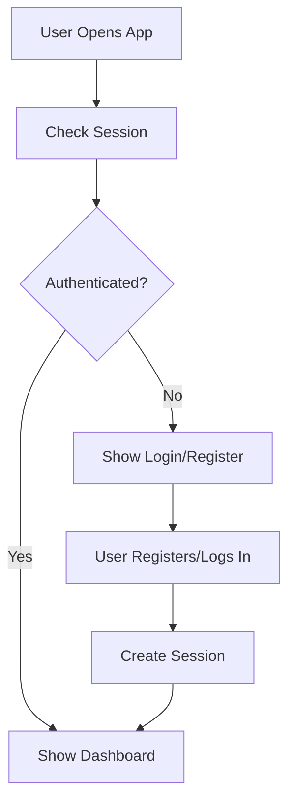
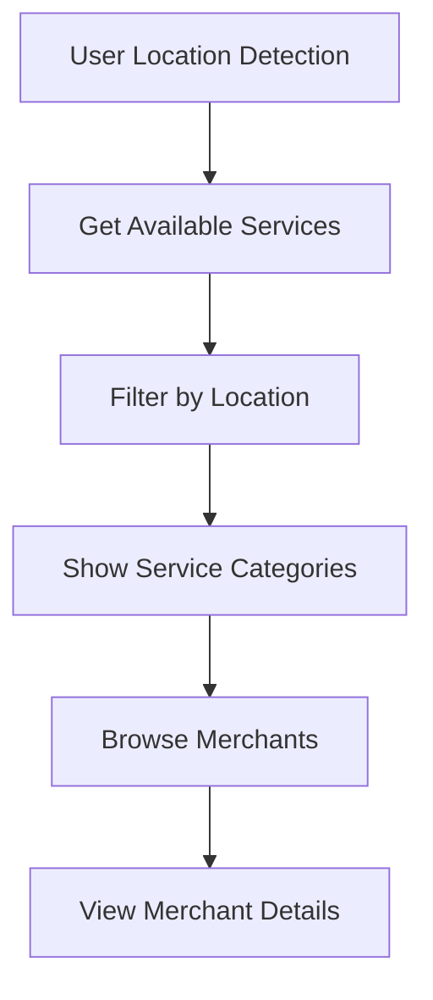
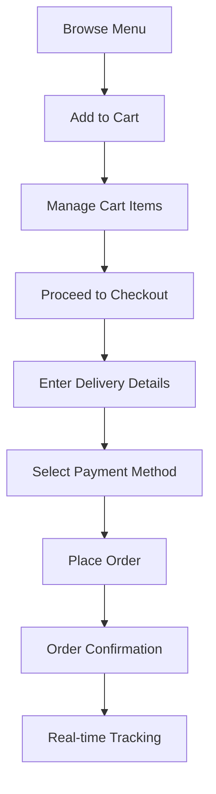
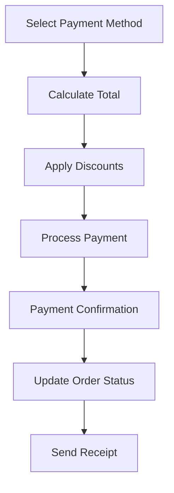
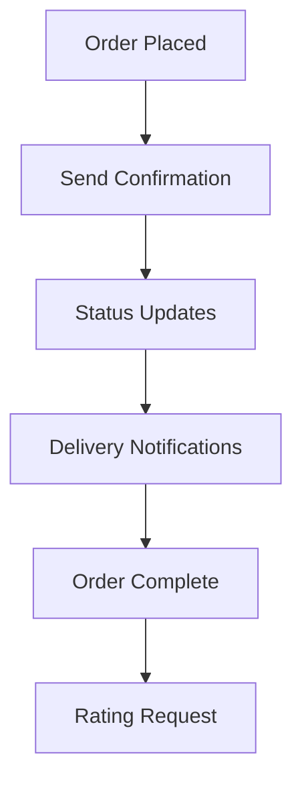

# Customer Experience Backend - Complete Requirements Analysis

## 🎯 **Customer Journey Breakdown**

### **📱 Customer App Analysis Results**

From analyzing your customer frontend, here's exactly what backend services are needed:

## 🔍 **Core Customer Experience Flows**

### **1. 🔐 User Authentication Flow**


**Backend Needs:**
- ✅ **User Service** (Port 3003) - **CREATED & RUNNING**
  - User registration with email/password
  - Authentication with JWT + cookies
  - Session management
  - Profile management
  - Multi-country user support

### **2. 🌍 Location & Service Discovery Flow**


**Backend Needs:**
- ✅ **Location Service** (Port 3001) - **ALREADY RUNNING**
  - Country/city management
  - Service category enablement per location
  - Geographic service discovery
- ✅ **Merchant Service** (Port 3002) - **ALREADY RUNNING**
  - Merchant listings by location
  - Menu/service catalog
  - Merchant details and ratings

### **3. 🛒 Shopping & Ordering Flow**


**Backend Needs:**
- ⏳ **Order Service** (Port 3006) - **MISSING - CRITICAL**
  - Shopping cart management
  - Order creation and processing
  - Order status management
  - Order history
  - Real-time order tracking

### **4. 💳 Payment & Billing Flow**


**Backend Needs:**
- ⏳ **Payment Service** (Port 3007) - **MISSING - CRITICAL**
  - Payment method management
  - Payment processing
  - Tax and fee calculation
  - Discount application
  - Transaction history

### **5. 🔔 Communication & Notifications Flow**


**Backend Needs:**
- ⏳ **Notification Service** (Port 3004) - **MISSING - IMPORTANT**
  - Push notifications
  - Email notifications
  - SMS notifications
  - Real-time order updates

## 📊 **Detailed Backend Service Requirements**

### **🛒 Order Service - CRITICAL FOR MVP**

#### **Core Functions Needed:**
```typescript
interface OrderServiceRequirements {
  // Cart Management
  createCart(userId: string, merchantId: string): Cart;
  addToCart(cartId: string, menuItemId: string, quantity: number): CartItem;
  updateCartItem(cartItemId: string, quantity: number): CartItem;
  removeFromCart(cartItemId: string): void;
  getCart(cartId: string): Cart;
  clearCart(cartId: string): void;
  
  // Order Processing
  createOrder(cartId: string, deliveryInfo: DeliveryInfo): Order;
  getOrder(orderId: string): Order;
  getUserOrders(userId: string): Order[];
  updateOrderStatus(orderId: string, status: OrderStatus): Order;
  cancelOrder(orderId: string, reason: string): CancelResult;
  
  // Order Tracking
  trackOrder(orderId: string): TrackingInfo;
  updateOrderLocation(orderId: string, location: Coordinates): void;
  getOrderHistory(userId: string): OrderHistory[];
  
  // Analytics
  getOrderStats(merchantId?: string): OrderStats;
}
```

#### **Database Tables Needed:**
```sql
-- ✅ Order Service owns this data
carts                    -- Shopping carts
cart_items              -- Items in carts
orders                  -- Completed orders
order_items            -- Items in orders
order_status_history   -- Status change tracking
order_tracking         -- Real-time tracking info
```

### **💳 Payment Service - CRITICAL FOR MVP**

#### **Core Functions Needed:**
```typescript
interface PaymentServiceRequirements {
  // Payment Methods
  addPaymentMethod(userId: string, method: PaymentMethod): PaymentMethod;
  getPaymentMethods(userId: string): PaymentMethod[];
  setDefaultPaymentMethod(userId: string, methodId: string): void;
  removePaymentMethod(methodId: string): void;
  
  // Payment Processing
  calculateOrderTotal(cartItems: CartItem[], taxes: TaxInfo): OrderTotal;
  processPayment(orderId: string, paymentMethodId: string): PaymentResult;
  refundPayment(orderId: string, amount: number, reason: string): RefundResult;
  
  // Discounts & Promotions
  validateDiscount(discountCode: string, orderData: OrderData): DiscountValidation;
  applyDiscount(orderId: string, discountCode: string): DiscountResult;
  
  // Transaction Management
  getTransactionHistory(userId: string): Transaction[];
  getTransactionDetails(transactionId: string): TransactionDetails;
}
```

#### **Database Tables Needed:**
```sql
-- ✅ Payment Service owns this data
payment_methods         -- User payment methods
transactions           -- Payment transactions
refunds                -- Refund records
discount_codes         -- Discount/promo codes
tax_calculations       -- Tax computation records
```

### **🔔 Notification Service - IMPORTANT FOR UX**

#### **Core Functions Needed:**
```typescript
interface NotificationServiceRequirements {
  // Push Notifications
  sendOrderUpdate(userId: string, orderId: string, status: string): void;
  sendPromotionalNotification(userId: string, promotion: Promotion): void;
  registerDeviceToken(userId: string, token: string, platform: string): void;
  
  // Email Notifications
  sendWelcomeEmail(userId: string): void;
  sendOrderConfirmation(orderId: string): void;
  sendOrderStatusUpdate(orderId: string, status: string): void;
  sendReceipt(orderId: string): void;
  
  // SMS Notifications
  sendOTP(phoneNumber: string, otp: string): void;
  sendOrderUpdate(phoneNumber: string, orderId: string, status: string): void;
  
  // In-App Notifications
  createInAppNotification(userId: string, message: NotificationMessage): void;
  getUnreadNotifications(userId: string): Notification[];
  markNotificationRead(notificationId: string): void;
}
```

#### **Database Tables Needed:**
```sql
-- ✅ Notification Service owns this data
notification_templates  -- Email/SMS templates
push_tokens            -- Device push tokens
notification_logs      -- Sent notification history
user_notification_prefs -- User notification preferences
```

## 🎯 **Customer Experience API Requirements**

### **🔐 Authentication APIs (User Service)**
```bash
# Registration & Login
POST /api/auth/register
POST /api/auth/login
GET  /api/auth/session
POST /api/auth/logout

# Profile Management
GET  /api/users/profile
PUT  /api/users/profile
POST /api/users/location
GET  /api/users/preferences
```

### **🛒 Shopping APIs (Order Service)**
```bash
# Cart Management
POST /api/carts/create
POST /api/carts/{id}/items
PUT  /api/carts/{id}/items/{itemId}
DELETE /api/carts/{id}/items/{itemId}
GET  /api/carts/{id}

# Order Management
POST /api/orders/create
GET  /api/orders/{id}
GET  /api/orders/user/{userId}
PUT  /api/orders/{id}/status
GET  /api/orders/{id}/tracking
```

### **💳 Payment APIs (Payment Service)**
```bash
# Payment Processing
POST /api/payments/process
GET  /api/payments/methods/{userId}
POST /api/payments/methods/add
POST /api/payments/calculate-total
POST /api/payments/apply-discount
GET  /api/payments/transactions/{userId}
```

### **🔔 Notification APIs (Notification Service)**
```bash
# Real-time Updates
POST /api/notifications/register-device
GET  /api/notifications/unread/{userId}
PUT  /api/notifications/mark-read/{id}
POST /api/notifications/send-order-update
```

## 📱 **Customer Frontend Integration Points**

### **🎨 Frontend Changes Needed**
```typescript
// ❌ Remove from customer frontend:
- /src/app/api/ directory (all backend routes)
- Direct database connections
- Authentication logic in frontend
- Business logic in components

// ✅ Add to customer frontend:
- API clients for each service
- Proper state management
- Error handling
- Loading states
- Real-time updates
```

### **🔗 Service Integration**
```typescript
// Customer frontend will call:
class CustomerApiClient {
  // User operations
  async login(email, password) {
    return fetch('http://localhost:3003/api/auth/login', {...});
  }
  
  // Cart operations
  async addToCart(cartId, item) {
    return fetch('http://localhost:3006/api/carts/${cartId}/items', {...});
  }
  
  // Payment operations
  async processPayment(orderId, paymentMethod) {
    return fetch('http://localhost:3007/api/payments/process', {...});
  }
  
  // All via API Gateway in production
}
```

## 🚀 **Implementation Priority**

### **🥇 Phase 1: Core Commerce (MVP)**
1. **✅ User Service** - Authentication & profiles ✅ DONE
2. **Order Service** - Cart & order management
3. **Payment Service** - Payment processing

### **🥈 Phase 2: Enhanced Experience**
4. **Notification Service** - Real-time updates
5. **Promotion Service** - Discounts & loyalty

### **🥉 Phase 3: Advanced Features**
6. **Analytics Service** - Customer insights
7. **Recommendation Service** - AI-powered suggestions
8. **Delivery Service** - Delivery partner management

## 📊 **Resource Requirements**

### **🛒 Order Service**
- **Complexity**: High (cart logic, order state management)
- **Database**: PostgreSQL (order data)
- **Dependencies**: User Service, Merchant Service, Payment Service
- **Development Time**: 2-3 days

### **💳 Payment Service**
- **Complexity**: High (payment processing, security)
- **Database**: PostgreSQL (transaction data)
- **Dependencies**: Order Service, external payment gateways
- **Development Time**: 2-3 days

### **🔔 Notification Service**
- **Complexity**: Medium (multiple notification channels)
- **Database**: PostgreSQL (notification logs)
- **Dependencies**: All services (for event notifications)
- **Development Time**: 1-2 days

## 🎯 **Minimum Viable Backend for Customer Experience**

### **✅ Already Running:**
- User Service (authentication) ✅
- Location Service (geographic data) ✅
- Merchant Service (business listings) ✅

### **⚠️ Critical Missing:**
- **Order Service** - Cannot have e-commerce without cart/order management
- **Payment Service** - Cannot process transactions without payment handling

### **💡 Optional for MVP:**
- Notification Service - Can start with basic email notifications
- Promotion Service - Can add later for retention

**For a functioning customer experience, we absolutely need Order Service and Payment Service. These are the core missing pieces that will complete the customer journey from browsing to purchasing.**

Ready to create the Order Service first? It's the most critical missing piece for customer experience! 🛒
