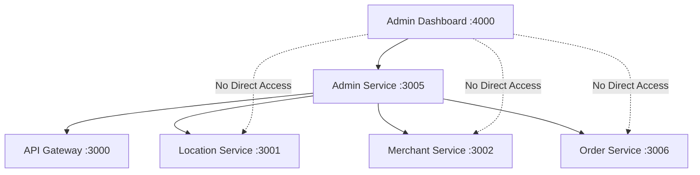

# MSDP Microservice Functions Definition

## 🏗️ Service Responsibilities Matrix

### **📡 API Gateway Service** (Port 3000)
```typescript
// ✅ OWNS: Routing, Authentication, Rate Limiting
interface APIGatewayFunctions {
  // Authentication & Authorization
  login(credentials: LoginRequest): AuthToken;
  validateToken(token: string): TokenValidation;
  refreshToken(refreshToken: string): AuthToken;
  
  // Request Routing
  routeToService(request: Request): ProxiedResponse;
  applyRateLimit(request: Request): RateLimitResult;
  applyCORS(request: Request): CORSResult;
  
  // Service Discovery
  getServiceHealth(): ServiceHealthMap;
  getServiceRoutes(): RouteConfiguration;
}

// ✅ DATA OWNERSHIP: 
// - User sessions
// - Rate limit counters
// - Service routing configurations
```

### **🌍 Location Service** (Port 3001 - Standalone)
```typescript
// ✅ OWNS: Geographic Data, Geospatial Operations
interface LocationServiceFunctions {
  // Geographic Hierarchy
  getCountries(): Country[];
  createCountry(country: CountryRequest): Country;
  getRegions(countryId: string): Region[];
  getCities(regionId: string): City[];
  
  // Service Enablement
  enableServiceInLocation(locationId: string, serviceId: string): EnablementResult;
  getEnabledServices(locationId: string): ServiceCategory[];
  
  // Geospatial Operations
  findNearbyLocations(lat: number, lng: number, radius: number): Location[];
  calculateRoute(origin: Coordinates, destination: Coordinates): Route;
  
  // Real-time Tracking
  trackDelivery(orderId: string): TrackingSession;
  updateLocation(sessionId: string, coordinates: Coordinates): TrackingUpdate;
}

// ✅ DATA OWNERSHIP:
// - Countries, regions, cities
// - Service categories
// - Location enablement rules
// - Geospatial data
// - Tracking sessions
```

### **🏪 Merchant Service** (Port 3002)
```typescript
// ✅ OWNS: Merchant Business Logic
interface MerchantServiceFunctions {
  // Merchant Management
  registerMerchant(merchant: MerchantRequest): Merchant;
  getMerchant(merchantId: string): Merchant;
  updateMerchantStatus(merchantId: string, status: MerchantStatus): Merchant;
  
  // Menu Management
  createMenuItem(merchantId: string, item: MenuItemRequest): MenuItem;
  getMenu(merchantId: string): MenuItem[];
  updateMenuItem(itemId: string, updates: MenuItemUpdate): MenuItem;
  
  // Merchant Analytics
  getMerchantMetrics(merchantId: string): MerchantMetrics;
  getMerchantOrders(merchantId: string): Order[];
}

// ✅ DATA OWNERSHIP:
// - Merchants
// - Menu items
// - Merchant-specific settings
// - Merchant analytics
```

### **🎛️ Admin Service** (Port 3005 - NEW)
```typescript
// ✅ OWNS: Admin Operations, Platform Management
interface AdminServiceFunctions {
  // Admin User Management
  createAdminUser(admin: AdminUserRequest): AdminUser;
  getAdminUsers(): AdminUser[];
  updateAdminRole(adminId: string, role: AdminRole): AdminUser;
  
  // Platform Management
  approveMerchant(merchantId: string): ApprovalResult;
  rejectMerchant(merchantId: string, reason: string): RejectionResult;
  enableLocationService(locationId: string, serviceId: string): EnablementResult;
  
  // Cross-Service Orchestration
  getDashboardData(): DashboardData;  // Aggregates from all services
  getPlatformMetrics(): PlatformMetrics;
  
  // Audit & Compliance
  logAdminAction(action: AdminAction): AuditLog;
  getAuditLogs(filters: AuditFilters): AuditLog[];
  
  // Platform Configuration
  updatePlatformSetting(key: string, value: any): PlatformSetting;
  getPlatformSettings(): PlatformSetting[];
}

// ✅ DATA OWNERSHIP:
// - Admin users and roles
// - Platform settings
// - Audit logs
// - Approval workflows
// - Cross-service orchestration state
```

### **🎨 Admin Dashboard** (Port 4000 - Frontend Only)
```typescript
// ✅ OWNS: UI/UX, Data Visualization
interface AdminDashboardFunctions {
  // UI Components
  renderDashboard(data: DashboardData): React.Component;
  renderMerchantManagement(merchants: Merchant[]): React.Component;
  renderLocationManagement(locations: Location[]): React.Component;
  
  // Data Fetching (via APIs only)
  fetchDashboardData(): Promise<DashboardData>;
  fetchMerchants(): Promise<Merchant[]>;
  fetchLocations(): Promise<Location[]>;
  
  // Admin Actions (via Admin Service API)
  approveMerchant(merchantId: string): Promise<void>;
  enableLocation(locationId: string): Promise<void>;
  updateSettings(settings: PlatformSettings): Promise<void>;
}

// ✅ DATA OWNERSHIP:
// - UI state only
// - User preferences
// - Dashboard configurations
// - NO business data
```

## 🔄 **Service Communication Flow**

### **✅ Proper Data Flow**


### **✅ Example: Get Dashboard Data**
```typescript
// 1. Admin Dashboard requests data
const dashboardData = await fetch('/api/admin/dashboard-data');

// 2. Admin Service orchestrates calls to other services
class AdminService {
  async getDashboardData() {
    const [merchants, locations, orders] = await Promise.all([
      fetch('http://merchant-service:3002/api/merchants/summary'),
      fetch('http://location-service:3001/api/locations/summary'),  
      fetch('http://order-service:3006/api/orders/summary')
    ]);
    
    return {
      merchants: merchants.data,
      locations: locations.data,
      orders: orders.data,
      aggregatedMetrics: this.calculateMetrics(merchants, locations, orders)
    };
  }
}
```

## 🎯 **Function Boundaries**

| Function | Current Owner | Correct Owner | Reason |
|----------|---------------|---------------|---------|
| **Merchant CRUD** | ❌ Admin | ✅ Merchant Service | Business logic ownership |
| **Location CRUD** | ❌ Admin | ✅ Location Service | Geographic data ownership |
| **Order Management** | ❌ Admin | ✅ Order Service | Transaction ownership |
| **Admin Users** | ✅ Admin | ✅ Admin Service | Administrative ownership |
| **Platform Settings** | ❌ Missing | ✅ Admin Service | Configuration ownership |
| **Merchant Approval** | ✅ Admin | ✅ Admin Service | Administrative workflow |
| **Cross-Service Analytics** | ❌ Admin | ✅ Admin Service | Orchestration responsibility |

## 🚀 **Implementation Strategy**

### **Phase 1: Create Admin Backend Service**
```bash
# 1. Create new admin service
msdp-platform-core/services/admin-service/
├── Port: 3005 (centralized)
├── Database: PostgreSQL:5438 (admin data only)
├── Functions: Admin users, platform settings, orchestration
```

### **Phase 2: Refactor Admin Frontend**
```bash
# 2. Convert admin dashboard to pure frontend
msdp-admin-frontends/apps/admin-dashboard/
├── Remove: Direct database access
├── Remove: Business logic
├── Add: API client for Admin Service
├── Keep: UI components and visualization
```

### **Phase 3: Service Integration**
```bash
# 3. Connect services via APIs
Admin Dashboard → Admin Service → Other Services
```

**Ready to implement this proper microservice architecture for the admin functions?** 🎯
