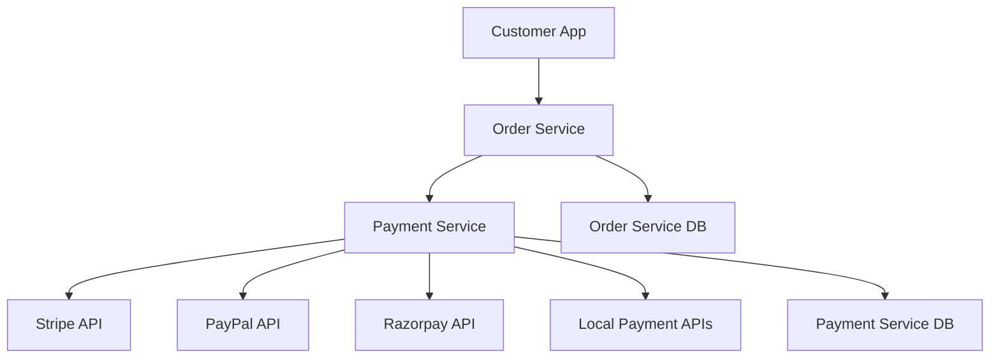
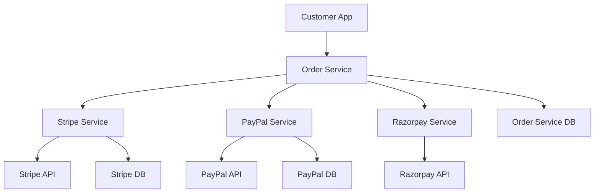
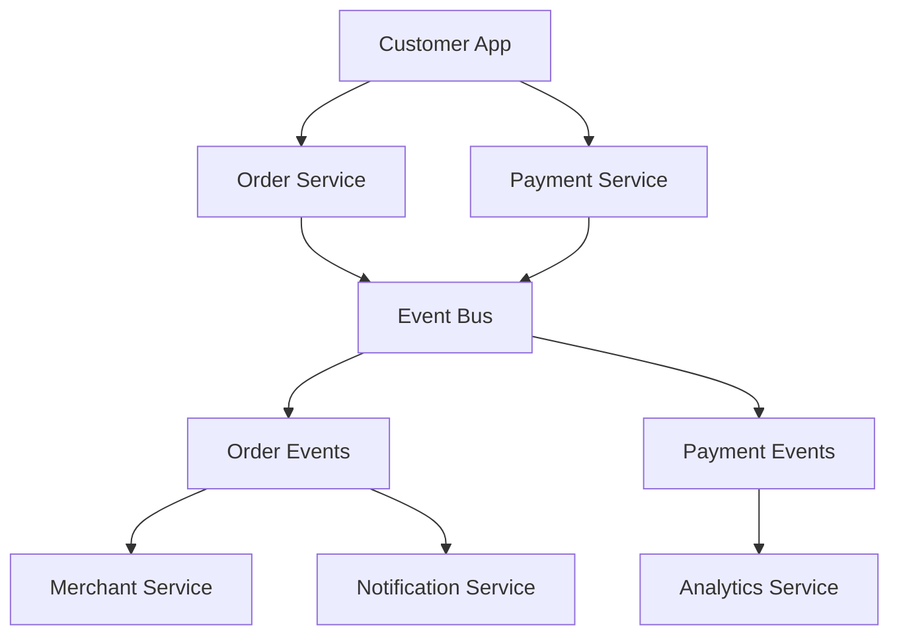
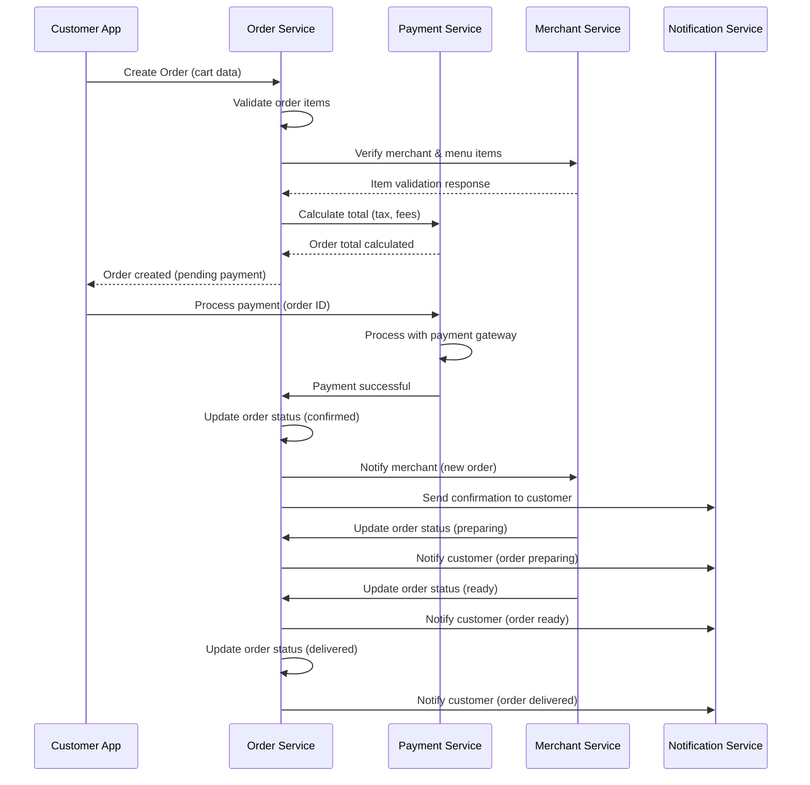
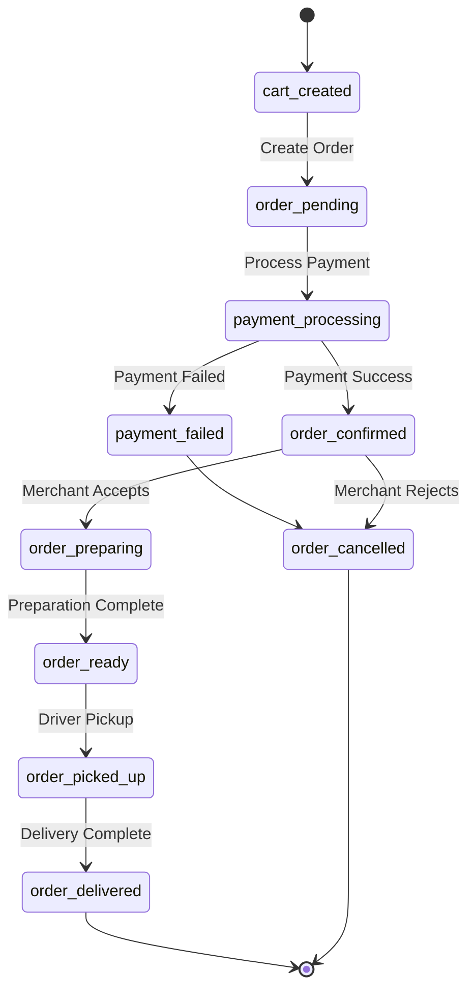

# Payment Gateway & Order Fulfillment Architecture Analysis

## 🎯 **Critical Design Questions**

### **🔍 Current Architecture Gaps**

We need to address these fundamental questions:

1. **Payment Gateway Integration**: How do we handle external payment providers?
2. **Order State Management**: What triggers order status changes?
3. **Payment-Order Coupling**: How tightly should payment and order services be coupled?
4. **Failure Handling**: What happens when payments fail or orders can't be fulfilled?
5. **Multi-Country Payments**: How do we handle different payment methods by country?

## 📊 **Payment Gateway Integration Patterns**

### **🔄 Option 1: Payment Service as Gateway Wrapper**


**Pros:**
- ✅ Single point of payment integration
- ✅ Consistent payment interface
- ✅ Easy to add new payment providers
- ✅ Centralized payment logic

**Cons:**
- ❌ Payment Service becomes complex
- ❌ Potential bottleneck
- ❌ Harder to scale payment methods independently

### **🔄 Option 2: Direct Payment Provider Integration**


**Pros:**
- ✅ Independent scaling per payment provider
- ✅ Provider-specific optimizations
- ✅ Easier to add country-specific providers

**Cons:**
- ❌ More complex service management
- ❌ Duplicate payment logic
- ❌ Harder to maintain consistency

### **🔄 Option 3: Event-Driven Payment & Order Coordination**


**Pros:**
- ✅ Loose coupling between services
- ✅ Easy to add new event consumers
- ✅ Excellent for analytics and monitoring
- ✅ Resilient to service failures

**Cons:**
- ❌ More complex to implement initially
- ❌ Eventual consistency challenges
- ❌ Debugging can be harder

## 🎯 **Order Fulfillment Flow Analysis**

### **🔍 Current Customer Frontend Requirements**

From analyzing the customer app, here's the expected flow:

```typescript
// Customer Frontend Expects:
1. Add items to cart
2. Proceed to checkout
3. Enter delivery details
4. Select payment method
5. Process payment
6. Order confirmation
7. Real-time tracking
8. Order completion
```

### **🔄 Recommended Payment-Order Flow**



## 💳 **Payment Gateway Integration Strategy**

### **🎯 Recommended: Payment Service as Gateway Abstraction**

```typescript
// Payment Service Architecture
interface PaymentService {
  // Gateway Abstraction Layer
  async processPayment(orderData: OrderData, paymentMethod: PaymentMethod): PaymentResult {
    const gateway = this.getGateway(paymentMethod.provider);
    return await gateway.processPayment(orderData, paymentMethod);
  }
  
  // Gateway Factory Pattern
  getGateway(provider: string): PaymentGateway {
    switch(provider) {
      case 'stripe': return new StripeGateway();
      case 'paypal': return new PayPalGateway();
      case 'razorpay': return new RazorpayGateway();
      default: throw new Error('Unsupported payment provider');
    }
  }
}

// Gateway Interface (Strategy Pattern)
interface PaymentGateway {
  processPayment(orderData: OrderData, method: PaymentMethod): Promise<PaymentResult>;
  refundPayment(transactionId: string, amount: number): Promise<RefundResult>;
  validatePaymentMethod(method: PaymentMethod): Promise<ValidationResult>;
}
```

### **🌍 Multi-Country Payment Strategy**

```typescript
// Country-Specific Payment Configuration
const PAYMENT_CONFIG = {
  US: {
    primaryGateway: 'stripe',
    supportedMethods: ['credit_card', 'debit_card', 'apple_pay', 'google_pay'],
    currency: 'USD',
    taxCalculation: 'us_sales_tax'
  },
  IN: {
    primaryGateway: 'razorpay',
    supportedMethods: ['credit_card', 'debit_card', 'upi', 'net_banking', 'wallet'],
    currency: 'INR',
    taxCalculation: 'gst'
  },
  GB: {
    primaryGateway: 'stripe',
    supportedMethods: ['credit_card', 'debit_card', 'apple_pay', 'google_pay'],
    currency: 'GBP',
    taxCalculation: 'vat'
  },
  SG: {
    primaryGateway: 'stripe',
    supportedMethods: ['credit_card', 'debit_card', 'grabpay', 'paynow'],
    currency: 'SGD',
    taxCalculation: 'gst'
  }
};
```

## 🔄 **Order Fulfillment State Machine**

### **📊 Order Status Flow**


### **🎯 Service Responsibilities**

```typescript
// Order Service Responsibilities
interface OrderServiceFlow {
  // Order Management
  createOrder(cartData: CartData): Order; // Creates order in 'pending' status
  confirmOrder(orderId: string): Order;   // After payment success
  cancelOrder(orderId: string, reason: string): Order;
  
  // Status Management
  updateOrderStatus(orderId: string, status: OrderStatus, actor: string): Order;
  getOrderStatusHistory(orderId: string): StatusHistory[];
  
  // Merchant Integration
  notifyMerchant(orderId: string, action: string): void;
  handleMerchantResponse(orderId: string, response: MerchantResponse): void;
}

// Payment Service Responsibilities  
interface PaymentServiceFlow {
  // Payment Processing
  calculateOrderTotal(orderData: OrderData): OrderTotal;
  processPayment(orderId: string, paymentData: PaymentData): PaymentResult;
  handlePaymentWebhook(provider: string, webhookData: any): void;
  
  // Payment Gateway Management
  validatePaymentMethod(method: PaymentMethod): ValidationResult;
  tokenizePaymentMethod(method: PaymentMethod): TokenizedMethod;
  
  // Financial Operations
  processRefund(orderId: string, amount: number, reason: string): RefundResult;
  calculateTaxes(orderData: OrderData, location: Location): TaxCalculation;
}
```

## 🔗 **Service Communication Patterns**

### **✅ Recommended: Synchronous + Asynchronous Hybrid**

```typescript
// Synchronous for Critical Path (Payment Processing)
class OrderService {
  async createOrder(cartData: CartData): Promise<Order> {
    // 1. Create order in 'pending' status
    const order = await this.createPendingOrder(cartData);
    
    // 2. Synchronously calculate total with Payment Service
    const orderTotal = await this.paymentService.calculateTotal(order);
    
    // 3. Update order with calculated amounts
    await this.updateOrderAmounts(order.id, orderTotal);
    
    return order;
  }
  
  async processOrderPayment(orderId: string, paymentData: PaymentData): Promise<OrderResult> {
    // 1. Synchronously process payment
    const paymentResult = await this.paymentService.processPayment(orderId, paymentData);
    
    if (paymentResult.success) {
      // 2. Synchronously confirm order
      const confirmedOrder = await this.confirmOrder(orderId);
      
      // 3. Asynchronously notify merchant and customer
      this.notifyMerchant(orderId);
      this.notifyCustomer(orderId, 'order_confirmed');
      
      return { success: true, order: confirmedOrder };
    } else {
      // 4. Cancel order if payment fails
      await this.cancelOrder(orderId, 'payment_failed');
      return { success: false, error: paymentResult.error };
    }
  }
}
```

### **🔔 Asynchronous for Non-Critical Updates**

```typescript
// Event-Driven for Status Updates
class OrderService {
  async updateOrderStatus(orderId: string, status: OrderStatus): Promise<void> {
    // 1. Update order status
    await this.updateStatus(orderId, status);
    
    // 2. Emit event for other services (non-blocking)
    this.eventBus.emit('order_status_changed', {
      orderId,
      status,
      timestamp: new Date()
    });
  }
}

// Event Listeners
class NotificationService {
  onOrderStatusChanged(event: OrderStatusEvent): void {
    this.sendOrderUpdateNotification(event.orderId, event.status);
  }
}

class AnalyticsService {
  onOrderStatusChanged(event: OrderStatusEvent): void {
    this.recordOrderMetric(event.orderId, event.status);
  }
}
```

## 🚨 **Critical Failure Scenarios**

### **💳 Payment Failure Handling**
```typescript
// Payment Service Failure Scenarios
class PaymentFailureHandler {
  async handlePaymentFailure(orderId: string, error: PaymentError): Promise<void> {
    switch(error.type) {
      case 'insufficient_funds':
        await this.orderService.updateOrderStatus(orderId, 'payment_failed');
        await this.notificationService.notifyCustomer(orderId, 'payment_declined');
        break;
        
      case 'invalid_card':
        await this.orderService.updateOrderStatus(orderId, 'payment_failed');
        await this.notificationService.requestNewPaymentMethod(orderId);
        break;
        
      case 'gateway_timeout':
        await this.orderService.updateOrderStatus(orderId, 'payment_pending');
        await this.schedulePaymentRetry(orderId);
        break;
        
      case 'fraud_detected':
        await this.orderService.cancelOrder(orderId, 'fraud_detected');
        await this.securityService.flagTransaction(orderId);
        break;
    }
  }
}
```

### **🏪 Merchant Fulfillment Scenarios**
```typescript
// Order Fulfillment Scenarios
class OrderFulfillmentHandler {
  async handleMerchantResponse(orderId: string, response: MerchantResponse): Promise<void> {
    switch(response.action) {
      case 'accept_order':
        await this.updateOrderStatus(orderId, 'confirmed');
        await this.estimateDeliveryTime(orderId);
        break;
        
      case 'reject_order':
        await this.cancelOrder(orderId, response.reason);
        await this.initiateRefund(orderId);
        break;
        
      case 'modify_order':
        await this.requestCustomerApproval(orderId, response.modifications);
        break;
        
      case 'delay_order':
        await this.updateDeliveryEstimate(orderId, response.newEstimate);
        await this.notifyCustomerOfDelay(orderId);
        break;
    }
  }
}
```

## 🎯 **Recommended Architecture**

### **✅ Payment Gateway Abstraction Layer**

```typescript
// Payment Service with Gateway Abstraction
class PaymentService {
  private gateways: Map<string, PaymentGateway>;
  
  constructor() {
    this.gateways = new Map([
      ['stripe', new StripeGateway()],
      ['paypal', new PayPalGateway()],
      ['razorpay', new RazorpayGateway()],
      ['square', new SquareGateway()],
    ]);
  }
  
  async processPayment(orderData: OrderData, paymentMethod: PaymentMethod): Promise<PaymentResult> {
    // 1. Select appropriate gateway based on country/method
    const gateway = this.selectGateway(orderData.countryCode, paymentMethod.type);
    
    // 2. Calculate fees and taxes
    const orderTotal = await this.calculateTotal(orderData);
    
    // 3. Process payment with selected gateway
    const paymentResult = await gateway.processPayment(orderTotal, paymentMethod);
    
    // 4. Record transaction
    await this.recordTransaction(orderData.orderId, paymentResult);
    
    // 5. Notify Order Service of payment result
    await this.notifyOrderService(orderData.orderId, paymentResult);
    
    return paymentResult;
  }
  
  selectGateway(countryCode: string, paymentType: string): PaymentGateway {
    const config = PAYMENT_CONFIG[countryCode];
    
    // Country-specific gateway selection
    if (countryCode === 'IN' && paymentType === 'upi') {
      return this.gateways.get('razorpay');
    }
    
    if (countryCode === 'US' && paymentType === 'apple_pay') {
      return this.gateways.get('stripe');
    }
    
    // Default to primary gateway for country
    return this.gateways.get(config.primaryGateway);
  }
}
```

### **✅ Order-Payment Coordination**

```typescript
// Order Service with Payment Coordination
class OrderService {
  async createOrderWithPayment(cartData: CartData, paymentData: PaymentData): Promise<OrderResult> {
    const transaction = await this.database.beginTransaction();
    
    try {
      // 1. Create order in pending status
      const order = await this.createOrder(cartData, 'pending', transaction);
      
      // 2. Process payment synchronously
      const paymentResult = await this.paymentService.processPayment(order, paymentData);
      
      if (paymentResult.success) {
        // 3. Confirm order
        await this.updateOrderStatus(order.id, 'confirmed', transaction);
        
        // 4. Commit transaction
        await transaction.commit();
        
        // 5. Asynchronously notify merchant and customer
        this.notifyMerchant(order.id);
        this.notifyCustomer(order.id, 'order_confirmed');
        
        return { success: true, order, payment: paymentResult };
      } else {
        // 5. Rollback on payment failure
        await transaction.rollback();
        
        return { success: false, error: paymentResult.error };
      }
    } catch (error) {
      await transaction.rollback();
      throw error;
    }
  }
}
```

## 🌍 **Multi-Country Payment Handling**

### **📊 Country-Specific Payment Configuration**

```typescript
// Country-Specific Payment Gateway Configuration
const COUNTRY_PAYMENT_CONFIG = {
  US: {
    primaryGateway: 'stripe',
    backupGateway: 'square',
    supportedMethods: [
      { type: 'credit_card', providers: ['stripe', 'square'] },
      { type: 'debit_card', providers: ['stripe', 'square'] },
      { type: 'apple_pay', providers: ['stripe'] },
      { type: 'google_pay', providers: ['stripe'] },
    ],
    currency: 'USD',
    taxRate: 0.0875, // 8.75% average sales tax
    processingFee: 0.029, // 2.9% + $0.30
  },
  
  IN: {
    primaryGateway: 'razorpay',
    backupGateway: 'payu',
    supportedMethods: [
      { type: 'credit_card', providers: ['razorpay', 'payu'] },
      { type: 'debit_card', providers: ['razorpay', 'payu'] },
      { type: 'upi', providers: ['razorpay'] },
      { type: 'net_banking', providers: ['razorpay', 'payu'] },
      { type: 'wallet', providers: ['razorpay'] },
    ],
    currency: 'INR',
    taxRate: 0.18, // 18% GST
    processingFee: 0.02, // 2% processing fee
  },
  
  GB: {
    primaryGateway: 'stripe',
    backupGateway: 'worldpay',
    supportedMethods: [
      { type: 'credit_card', providers: ['stripe', 'worldpay'] },
      { type: 'debit_card', providers: ['stripe', 'worldpay'] },
      { type: 'apple_pay', providers: ['stripe'] },
      { type: 'google_pay', providers: ['stripe'] },
    ],
    currency: 'GBP',
    taxRate: 0.20, // 20% VAT
    processingFee: 0.025, // 2.5% + £0.20
  }
};
```

## 🔒 **Security & Compliance Considerations**

### **🛡️ Payment Security Requirements**

```typescript
// Payment Security Implementation
class PaymentSecurityHandler {
  // PCI DSS Compliance
  async tokenizePaymentMethod(method: PaymentMethod): Promise<TokenizedMethod> {
    // Never store raw card data
    const gateway = this.getGateway(method.provider);
    return await gateway.createPaymentMethodToken(method);
  }
  
  // Fraud Detection
  async validateTransaction(orderData: OrderData, paymentData: PaymentData): Promise<FraudCheck> {
    const riskFactors = [
      this.checkVelocity(orderData.userId),
      this.checkGeolocation(orderData.deliveryAddress, paymentData.billingAddress),
      this.checkOrderAmount(orderData.total, orderData.userId),
      this.checkPaymentMethod(paymentData.method),
    ];
    
    const riskScore = this.calculateRiskScore(riskFactors);
    
    if (riskScore > 0.8) {
      return { approved: false, reason: 'high_risk', requiresReview: true };
    }
    
    return { approved: true, riskScore };
  }
  
  // 3D Secure for International Cards
  async require3DSecure(paymentMethod: PaymentMethod, amount: number): Promise<boolean> {
    return amount > 30 && paymentMethod.country !== paymentMethod.issuerCountry;
  }
}
```

## 📊 **Database Transaction Strategy**

### **🔄 ACID Compliance for Critical Operations**

```typescript
// Critical: Payment + Order must be atomic
class OrderPaymentTransaction {
  async processOrderPayment(orderData: OrderData, paymentData: PaymentData): Promise<Result> {
    const orderTransaction = await this.orderDB.beginTransaction();
    const paymentTransaction = await this.paymentDB.beginTransaction();
    
    try {
      // 1. Create order record
      const order = await this.createOrder(orderData, orderTransaction);
      
      // 2. Process payment
      const payment = await this.processPayment(order.id, paymentData, paymentTransaction);
      
      if (payment.success) {
        // 3. Confirm order
        await this.confirmOrder(order.id, orderTransaction);
        
        // 4. Commit both transactions
        await orderTransaction.commit();
        await paymentTransaction.commit();
        
        return { success: true, order, payment };
      } else {
        // 5. Rollback both on failure
        await orderTransaction.rollback();
        await paymentTransaction.rollback();
        
        return { success: false, error: payment.error };
      }
    } catch (error) {
      await orderTransaction.rollback();
      await paymentTransaction.rollback();
      throw error;
    }
  }
}
```

## 🎯 **Recommended Implementation Strategy**

### **🥇 Phase 1: Basic Payment-Order Flow**
```typescript
// Simple synchronous flow for MVP
Order Service → Payment Service → Payment Gateway → Order Confirmation
```

### **🥈 Phase 2: Enhanced Failure Handling**
```typescript
// Add retry logic, fraud detection, multi-gateway support
Order Service ↔ Payment Service ↔ Multiple Gateways
```

### **🥉 Phase 3: Event-Driven Architecture**
```typescript
// Add event bus for analytics, notifications, complex workflows
Order Service → Event Bus ← Payment Service
              ↓
    Notification, Analytics, Audit Services
```

## 🎯 **Key Architectural Decisions Needed**

### **❓ Questions to Resolve**
1. **Payment Timing**: Process payment before or after merchant confirmation?
2. **Gateway Failover**: How to handle primary gateway failures?
3. **Refund Policy**: Automatic vs manual refund processing?
4. **Inventory Management**: How to handle out-of-stock items during payment?
5. **Multi-Currency**: Support for currency conversion?

### **💡 Recommended Decisions**
1. **Payment First**: Process payment immediately, hold funds, release on delivery
2. **Gateway Failover**: Automatic failover to backup gateway per country
3. **Refund Policy**: Automatic refunds for cancellations, manual for disputes
4. **Inventory Check**: Validate availability before payment processing
5. **Multi-Currency**: Support local currency, convert at payment time

**This analysis shows we need a robust Payment Service that abstracts payment gateways and coordinates closely with the Order Service. Ready to implement this architecture?** 💳🛒
